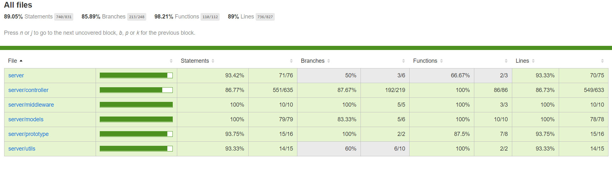

# Server

> 基于 Express 和 Mongodb 构建的数据服务。

## 简介

此包可以单独使用，可作为任何项目的数据依赖，所有接口都有详细描述。

## 快速开始

  1. 启动 Mongodb 服务
  2. 执行 npm install 或者是 yarn 安装依赖
  3. 执行 npm start 或者是 yarn start
  4. 检查服务是否开始，浏览器访问 http://localhost:3000/api 是否有返回JSON。

## API文档

[使劲戳API文档](../API.md)

## 测试覆盖率



## 超级管理员

在`models/data/root.js`文件中可修改初始化数据库时的超级管理员用户。

## 非法的域名

本项目设置了跨域请求，客户端无需在设置跨域相关问题，同时设置了域名拦截功能，也就是制定的域名才能够请求。
设置位于`app.js`中，可改变`ALLOW_ORIGIN`中内容来设置允许请求的域名，如果注释此段，任何域名都能请求同时跨域请求也失效，你可自行设置，或者在客户端设置。

```javascript
const ALLOW_ORIGIN = [
  'localhost:3000'
];

app.all('*', (req, res, next) => {
  const reqOrigin = req.headers.origin || req.headers.host;
  if (ALLOW_ORIGIN.includes(reqOrigin)) {
    res.header('Access-Control-Allow-Origin', reqOrigin);
    res.header('Access-Control-Allow-Headers', 'Content-Type, Authorization, X-Requested-With');
    res.header('Access-Control-Allow-Methods', 'GET,POST,PUT,PATCH,DELETE,OPTIONS');
    res.header('Access-Control-Allow-Credentials', true);
    res.header('X-Powered-By', '3.2.1');
    if (req.method === 'OPTIONS') {
      res.sendStatus(200);
    } else {
      next();
    }
  } else {
    res.send({
      status: 0,
      type: 'ILLEGAL DOMAIN NAME',
      message: '非法的域名'
    });
  }
});
```
