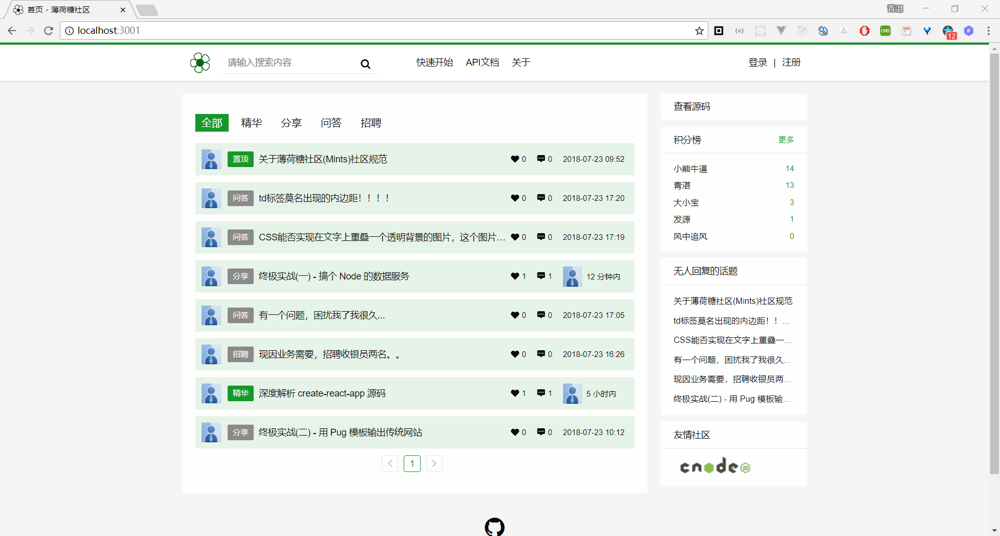
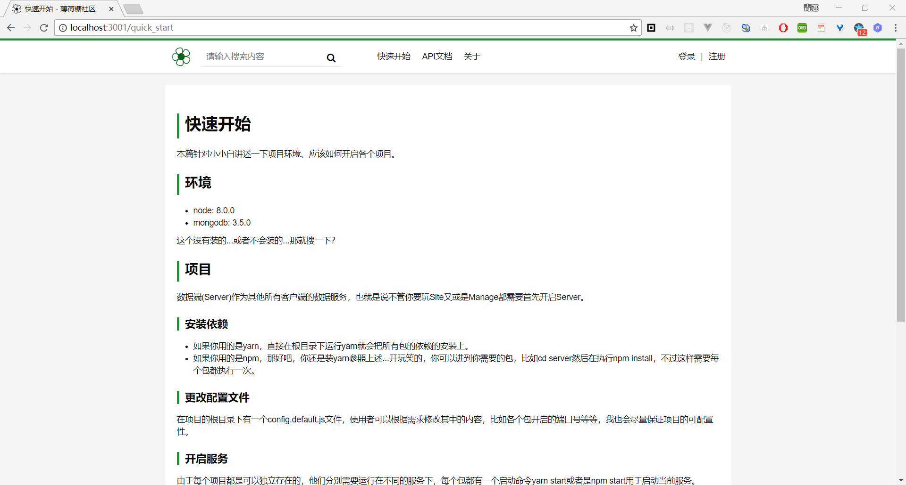
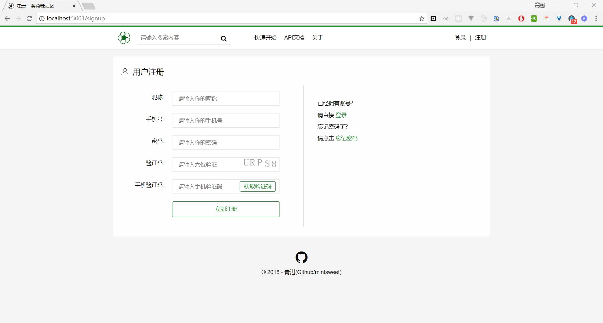
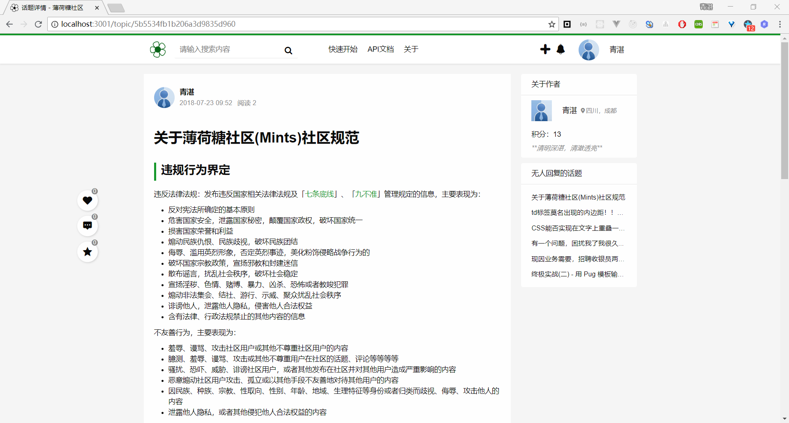
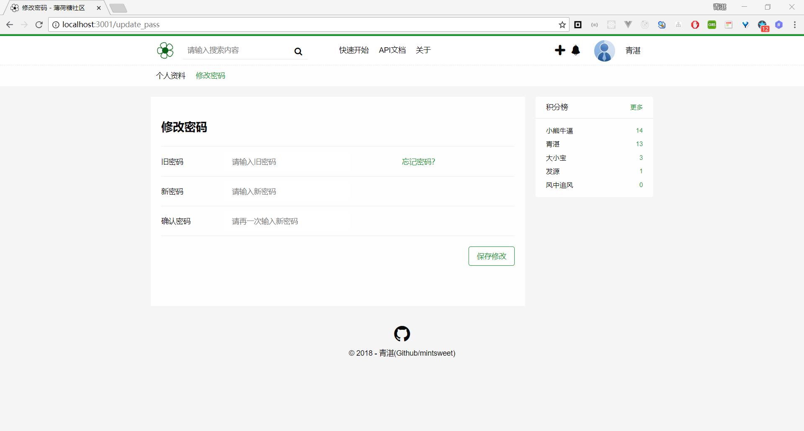
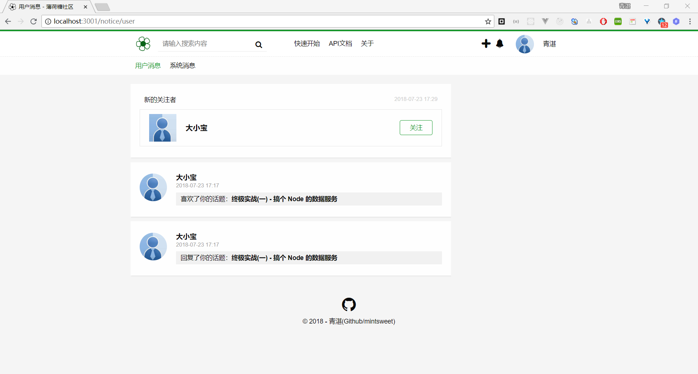
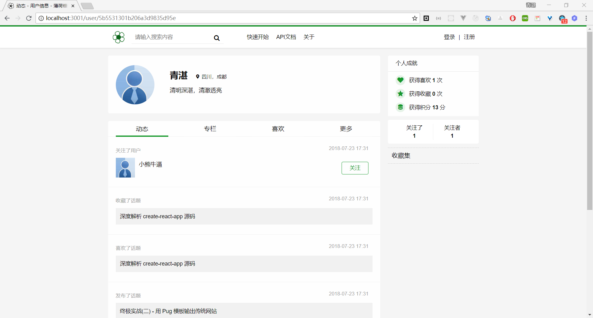

# Site

> 基于 Express 和 Pug 构建的传统网站

## 简介

本包是由`Pug`模板输出的传统形式的网站，在这里不直接操作数据库，也就是使用`http`来请求`Server`得到数据，再由`Pug`输出。

## 快速开始

  1. 执行 npm install 或者是 yarn 安装依赖
  2. 启动 server 服务
  3. 执行 npm start 或者 yarn start
  4. 浏览器访问 http://localhost:3001

## 项目截图

